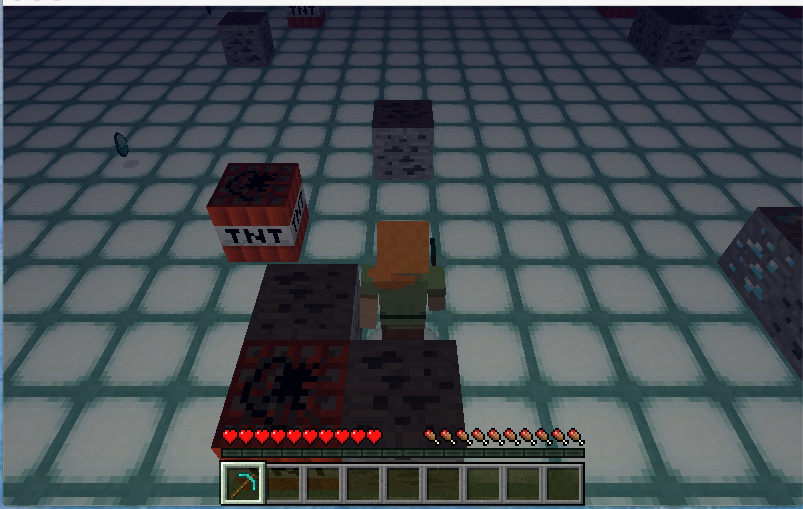
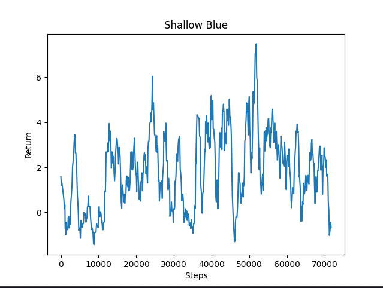
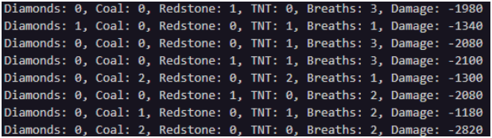

## Video
<iframe width="640" height="480" src="https://www.youtube.com/embed/jsDZ6G1oCIc" frameborder="0" allow="accelerometer; autoplay; clipboard-write; encrypted-media; gyroscope; picture-in-picture" allowfullscreen></iframe>

## Project Summary 
  
  

Our goal was to create an agent that gathers underwater resources in the most efficient way possible. The agent is dropped into a random spot in an environment composed of a flat, 40x40 block seabed with a water depth of 10 blocks. Diamond ore, coal ore, loose diamonds, and loose coal are randomly spawned throughout the bottom of this environment; these act as the resources the agent must gather. Blocks of TNT that the agent must learn to avoid are similarly distributed. Finally, the surface of the water is littered with redstone blocks that impair the agent’s ability to refill its air level. Depending on these obstacles, our agent learns to take appropriate actions, such as heading to the surface of the water to replenish air, avoiding obstacles, and collecting resources. 

There are many challenges that go into this resource collection task. The agent must explore the environment aggressively enough to find resources that are spread out from each other, mine for longer periods of time underwater when compared to on the surface, and balance “breathing” with spending more time underwater. Additionally, the high level of variability of the environment (the agent might encounter 4 unique types of blocks and 2 kinds of items) produces numerous different states that the agent must learn from. Our group’s hope was that a Machine Learning approach to making sense of this large amount of input data would yield a useful result. Consequently, our team’s imagined use case for a “perfect” agent would be an automated underwater resource collection tool that can perform time-consuming, repetitive work for Minecraft players interested in gathering sand, clay, and various fish. Although our agent does not perform well enough to achieve this goal, it performs reasonably well in a diverse set of environments, gathering 2 to 3 items per episode without drowning.  
<br/>  

## Approaches
Our best-performing implementation takes cues from Kolby’s improved Assignment Two code that uses RLlib, and the main algorithm we used is RLlib’s Clipped Objective Proximal Policy Optimization (PPO) with the default PyTorch network. The policy is updated by performing gradient descent on the equation below: 

L<sup>CLIP</sup>($$\theta$$) = E<sup>^</sup>$$_{t}[min(r_{t}(\theta$$) A<sup>^</sup>$$_{t}, clip(r_{t}(\theta), 1 - \epsilon, 1 + \epsilon$$) A<sup>^</sup>$$_{t}]$$

We saw a significant enough increase in both reward attained and behaviors learned just by switching to this method from the implementation used for our Status Report. As a result, we decided to focus on making the environment more complex, improving our logging systems, and tuning our hyperparameters instead of modifying the underlying framework.
	
The agent’s observations consist of a 3x5x5 grid, similar to that of Assignment Two but with a few additions. To start, the grid obtained from `<ObservationFromGrid>` is extended into the `y=1` plane. This way, the agent can detect the presence of redstone blocks above it as it attempts to make its way back up to the surface. Additionally, we constructed another grid containing the entities in a 5x5 grid around the agent based on the list returned by `<ObservationFromNearbyEntities>`. This grid was used to detect the presence of loose resources that are not present in the aforementioned grid of blocks and was inspired by the fellow project team [MineFarm-Farmer](https://yongfeitan.github.io/MineFarm-Farmer/status.html). These two grids (each consisting of 25 blocks in 3 dimensions) are combined together and sent to the network. Other observations, including the agent’s air level, damage taken, and resources collected are used to update programmatic rewards as well.

```python
  if self.allow_break_action and action[3] > 0:
        self.agent_host.sendCommand('move 0')
        self.agent_host.sendCommand('turn 0')
        self.agent_host.sendCommand('jump 0')
        self.agent_host.sendCommand('attack 1')
        time.sleep(2)
    elif (self.air_level < self.air_threshold * FULL_AIR) and action[2] > 0:
        self.agent_host.sendCommand('move 0')
        self.agent_host.sendCommand('turn 0')
        self.agent_host.sendCommand('attack 0')
        self.agent_host.sendCommand('jump 1')
        time.sleep(1)
    else:
        if action[2] < 0: self.agent_host.sendCommand('jump 0')
        self.agent_host.sendCommand('attack 0')
        self.agent_host.sendCommand(f'move {action[0]:30.1}')
        self.agent_host.sendCommand(f'turn {action[1]:30.1}')
        time.sleep(0.2)
    self.episode_step += 1
```

Our agent’s continuous action space consists of real values between -1 and 1. These translate to four types of actions: move, turn, jump (used to initiate and cancel swimming), and attack. For moving and turning, the value returned from the network is simply passed to Malmo. Values for the remaining two actions are thresholded as shown above. Additionally, we used Kolby’s suggestion and `sleep()` the agent when a jump or attack command needs to be executed to stop other actions from interrupting them. Furthermore, we only allowed the agent to swim up to the surface (`jump 1`) if its air level was significantly depleted. This allowed our agent to explore the environment longer instead of needlessly swimming up when it didn’t have to. 

Our agent also has access to numerous different positive and negative rewards. The largest ones in magnitude are those obtained from acquiring a diamond, +5, and coal, +2, either through mining ore or picking them up off the ground. The agent earns rewards of -0.1 everytime it touches a redstone or TNT block. These two obstacles and rewards were introduced to make the environments more complex. Another positive reward of +0.1 is awarded to the agent every time it takes a breath, and a negative reward equal to 0.1% of the health lost is assigned every step when damage is taken. Both of these rewards were configured programmatically, relied on `<ObservationFromFullStats>`, and were used to encourage breathing. Finally, our agent receives a negative reward of -1 if it drowns.

The agent’s terminal states are the end of an episode or drowning. Drowning does not happen often, as the agent is usually able to return to the surface of the water at least once per episode. The maximum number of episode steps was increased to 500 to give the agent more time to learn, as it was difficult for the agent to display much behavior with the previous limit of 100. 

The main baseline we compared this version of our agent to was the one used for our Status Report. That agent was based on the original Assignment Two code, which used the QNetwork class to implement Deep Q-network Reinforcement Learning. The main limitation of this agent was its inability to learn complex behaviors, even after training for long periods of time. The large number of discrete actions it needed to learn (8 as opposed to the original Assignment Two’s 4) undoubtedly hampered its progress. Furthermore, this discrete action space did not extend to more complex scenarios we imagined for our agent, such as executing turns while swimming to avoid obstacles. For our final version, there are again only 4 values produced by our network that get mapped to actions. 

  
| Status Report Average Return | Current Agent Average Return |    
| :--------------------------: | :--------------------------: |  
|  |  |  

Additionally, our RLlib agent achieved a higher maximum and average return as shown in the right-hand side graph above. Our video also demonstrates that this current agent is able to achieve more desired behaviors, such as taking more breaths per episode to increase exploration time, avoiding redstone, and more.

While the current form of our agent has numerous advantages as outlined above, its one disadvantage is the large increase in the number of observations passed to our network. Due to the `<ObservationFromGrid>` being extended another dimension, there is a 50% increase in the flattened observation size. These extra 25 values likely increase the complexity of our network and the time needed for PPO to converge. However, since the average return increased significantly compared with the older approach, we settled on this version of our agent.  
<br/>  

## Evaluation
Before diving into our quantitative evaluation, we would like to establish baselines for our agent’s behaviors. As seen in the Approach section above, our Status Report agent would, on average, earn a positive return between 0.5 and 1. This was due to its tendency to randomly swim up and down which, while saving the agent from drowning, wouldn’t allow it to gather many resources. For our current well-trained agent (20000 steps), our goal was for it to collect 3-4 diamond/coal pieces on average each episode. Additionally, we assumed our agent would converge to an average of 2 breaths of air per episode, which should allow it the optimal time to spend underwater without drowning. Lastly, we hoped that it would never touch redstone or TNT blocks. This would translate to a return of approximately 10 (assuming 1 diamond piece, 2 coal, and breathing rewards balancing out any damage taken rewards).



*Early training metadata sample (approximately 1000 steps in)*

A few key takeaways can be seen from this sample of metadata. First of all, the primary purpose of this agent is to collect resources. We can quantitatively see that the agent was rather unsuccessful in finding diamonds (which are more sparse), but was able to achieve some success when it came to acquiring coal. Regarding obstacle avoidance, the agent was consistently touching either redstone or TNT, often more than once. However, the agent was able to achieve the behavior of swimming up to the surface of the water for air. Although, this is a behavior we helped create with some conditional logic revolving around our agent’s current air level as mentioned in the Approach section. Finally, the damage taken seems to fluctuate quite a bit.


*Late training metadata sample (approximately 20000 steps in)*  

With this sample taken later in the training process, we can see that our agent is more successful in executing intended behaviors. Our agent picks up 1-2 diamonds and 0-1 coal on average. Diamonds do have a much higher reward (+5 vs +2), so it makes sense for the agent to prioritize picking them up when possible. Our agent was also able to avoid all surface redstone obstacles in this sample. When it came to avoiding TNT, our agent appears to have struggled during a few episodes, but was mostly able to avoid the obstacle. Our hypothesis is that as the agent learns to spend more time underwater, it is more likely to run into underwater obstacles rather than the redstone on the surface. Lastly, our agent now consistently comes to the surface for air more than once per episode. As mentioned, we predicted our agent would achieve 2-3 breaths every episode. Finally, the damage our agent sustains did not seem to meaningfully decrease. However, we do not think this impacts the success of our agent since it should be able to sacrifice health to gather more resources as long as it does not drown.


*Return over 70000 steps*

We can see from this graph that our agent’s return certainly fluctuates, despite a large proportion of the data still trending upwards. Unfortunately, we still have instances where our agent is either not collecting any resources, or our negative rewards outweighed any positive behavior (for example, the agent might have only picked up a single coal piece and took a lot of damage or hit many obstacles). This graph is also from our longest training session of 140 episodes. We did not get an opportunity to see if training even longer than this would help overcome the complexities of executing several behaviors successfully.

Our qualitative evaluation also relies on the metadata logging shown above. These logs were used to visualize the effectiveness of features we added to our agent since the Status Report submission. Some new features are the inclusion of two different kinds of obstacles, having both loose resources and ore, and incorporating longer episode lengths. By adding these features to our project, we are able to concretely evaluate whether our agent is able to successfully learn and execute more behaviors than before. A comparison between the two versions of our agent is shown below:

  
| Status Report Agent | Current Agent |    
| ------------------- | ------------- |  
| &nbsp;&nbsp;&nbsp;Mining diamond ore&nbsp;&nbsp;&nbsp;  | &nbsp;&nbsp;&nbsp;Mining diamond ore&nbsp;&nbsp;&nbsp; |  
| &nbsp;&nbsp;&nbsp;Mining coal ore&nbsp;&nbsp;&nbsp;     | &nbsp;&nbsp;&nbsp;Mining coal ore&nbsp;&nbsp;&nbsp; |  
| &nbsp;&nbsp;&nbsp;&nbsp;&nbsp;&nbsp;Swimming to the surface for air (only did this once to survive)&nbsp;&nbsp;&nbsp; | &nbsp;&nbsp;&nbsp;Swimming to the surface for air >1 times (due to longer episodes)&nbsp;&nbsp;&nbsp; |  
|                     | &nbsp;&nbsp;&nbsp;Collecting loose diamonds&nbsp;&nbsp;&nbsp; |  
|                     | &nbsp;&nbsp;&nbsp;Collecting loose coal&nbsp;&nbsp;&nbsp; |  
|                     | &nbsp;&nbsp;&nbsp;Avoiding TNT blocks on the seabed&nbsp;&nbsp;&nbsp; |  
|                     | &nbsp;&nbsp;&nbsp;Avoiding redstone blocks on the surface&nbsp;&nbsp;&nbsp; |  
|                     | &nbsp;&nbsp;&nbsp;Limiting the amount of damage taken (our agent takes damage when out of air)&nbsp;&nbsp;&nbsp; |  

Our video also contains examples of some of the behaviors mentioned above. There our agent can be seen actively applying these behaviors depending on the states it encounters and shows definitive examples of how the current agent improves over the Status Report agent baseline. 

A final thought to consider is that our agent may not have had enough intrinsic motivation to explore our environment. Our first approach with Q-learning leveraged an epsilon-greedy approach when selecting actions. This tendency to ignore Q-Values and select random actions might have produced enough variation in early stages of training to create a strong enough foundation for future iterations. Since advancing to RLlib and switching to PPO, we did increase our agent’s return. However, we would have liked to see our agent cover more ground exploring our underwater environment. We tried using rewards as a tool to motivate this exploration but were unable to reliably encourage our agent to encounter new states. 

In summary, our agent performs significantly better compared to our Status Report submission, earning a maximum return of 7 and an average of 3. While we certainly fell short of our moonshot goal of a fully automated agent, we believe we made significant progress toward this milestone, as seen in our large increase in average return from the Status Report. Furthermore, we did not get to a point where we could test our agent on environments with varying topologies, including underwater structures (temples, mountains), and MOBs. Finally, the underlying network used by RLlib’s PPO algorithm should have been experimented with to improve our return. Both of these aspects of our project could certainly be revisited if we were to continue this endeavor into the future.  
<br/>  
 
## References
[Kolby's RLlib starter code](https://campuspro-uploads.s3.us-west-2.amazonaws.com/ad12d7f8-a456-4244-bd96-18be6a728aca/662f51cc-2587-4f7f-b5af-a59aff45727c/assignment2_rllib_cont.py)

[Malmo Schema Docs](https://microsoft.github.io/malmo/0.30.0/Schemas/Mission.html)

[Inspiration for creating a grid of nearby entities](https://yongfeitan.github.io/MineFarm-Farmer/status.html)

[RL with Sparse Rewards](https://towardsdatascience.com/reinforcement-learning-with-exploration-by-random-network-distillation-a3e412004402)

[PPO Explained](https://jonathan-hui.medium.com/rl-proximal-policy-optimization-ppo-explained-77f014ec3f12)
