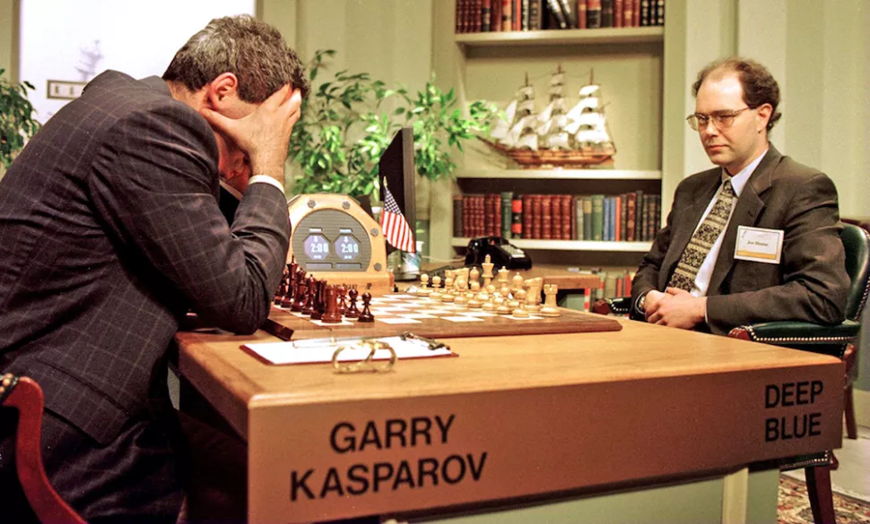
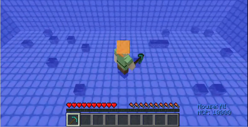

## What is intelligence?

### Introduction
The name for our project, ***Shallow Blue***, is a play off of ***Deep Blue***, the name of the famous IBM chess-playing computer that defeated Garry Kasparov.

### Project Summary
Our project uses reinforcement learning to effectively gather resources underwater. Using Minecraft Malmo as our testbed, we dynamically create underwater environments with various resources scattered at the bed of the water. Our AI agent swims under water, finds resources, and swims up for air. Our goal for this project is to improve our agent's ability to find resources, stay alive, and navigate new underwater terrain!

### Q-Network

Our Q-Network currently receives a 2x5x5 observation which are all of the surrounding blocks. We flatten this observation and append the 'yPos' of our agent. This a total of 51 values that we then modify into 0s and 1s. If the surrounding blocks are mine-able, they receieve a value of 1, otherwise they are 0. As for the 'yPos' value, we assign it a 1 when the agent is underwater, otherwise it is 0. The 8 q-values that our network outputs are the 8 possible actions our agent can execute.

These actions are:

1. Move one block forward
2. Set yaw to 0
3. Set yaw to 90
4. Set yaw to 180
5. Set yaw to 270
6. Deactivate continuous jump
7. Activate continuous jump
8. Destroy block

Furthermore, our reinforcement learning relies on 3 rewards and 2 terminal states:

Rewards: +2 reward for gathering each diamond, +0.5 reward for gathering each coal, -1 reward for drowning
Terminal States: 100 steps or drowning

### Environment

Our environment is a 10x20x20 swimming pool with various resources scattering the bed of the water. The resources currently in our environment are diamonds and coal, however we plan to add more.

### Source Code
[https://github.com/chasechipres/shallowblue](https://github.com/chasechipres/shallowblue)
