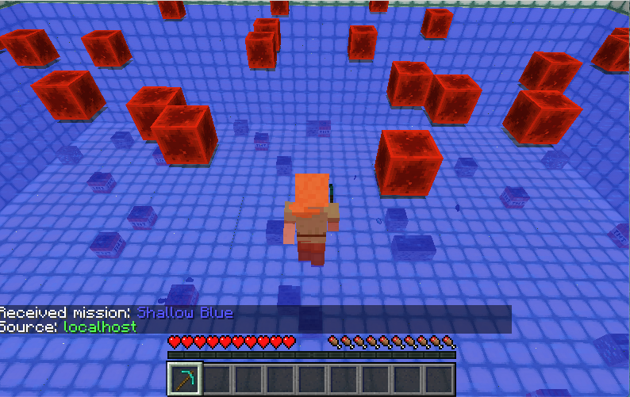

# What is intelligence?

## Introduction
The name for our project, ***Shallow Blue***, is a play off of ***Deep Blue***, the name of the famous IBM chess-playing computer that defeated Garry Kasparov.

## Project Summary
Our project uses reinforcement learning to effectively gather resources underwater. Using Minecraft Malmo as our testbed, we dynamically create underwater environments with various resources scattered at the bed of the water. Our AI agent swims under water, finds resources, and swims up for air. Our goal for this project is to improve our agent's ability to find resources, stay alive, and navigate new underwater terrain!

## Approach

**Observations:**

Our network receives a 3x5x5 observation array which consists of surrounding blocks and entities. These 75 observations take on different numerical values depending on the block or item seen (diamond ore, coal ore, diamonds, coal, redstone blocks, TNT blocks). 

**Continuous Actions**:
1. Move
2. Turn
3. Jump
4. Attack

**Rewards**: 
1. +5 reward for gathering each diamond
2. +2 reward for gathering each coal
3. -0.1 for touching redstone
4. -0.1 for touching TNT
5. -0.1% of damage taken each step when agent has run out of air
6. -1 reward for drowning 

**Terminal States**: 500 steps or drowning

## Environment

Our environment is a 10x40x40 swimming pool with various resources and obstacles on the seabed and surface of the water. 

## Source Code
[https://github.com/chasechipres/shallowblue](https://github.com/chasechipres/shallowblue)
