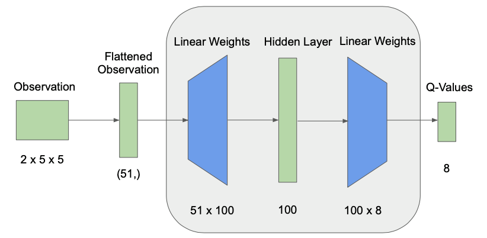

<iframe width="640" height="480" src="https://www.youtube.com/embed/8le6hKJmdII" frameborder="0" allow="accelerometer; autoplay; clipboard-write; encrypted-media; gyroscope; picture-in-picture" allowfullscreen></iframe>

## Project Summary
We aim to create an agent that gathers underwater resources in the most efficient way possible. For the final version, the agent will receive observations from its environment in the form of the types of blocks in its line of sight. It will then take appropriate actions, such as heading to the surface of the water to replenish air, avoiding obstacles and hostile mobs, and collecting loose and mined resources. The environment will start out as a flat 80x80 block seabed with a depth of 10 blocks, but will vary to include more challenges, including underwater structures, partially covered surfaces (to make getting air more difficult), items that replenish hunger and air levels, and more. This project could potentially be used to automate the repetitive task of gathering aquatic materials such as sand, clay, and food items, including various fish.
 
## Approach
Our initial implementation was modeled off of the original Assignment Two; the main algorithm used is Deep Q-Network reinforcement learning. We used the given Neural Network with two fully connected layers and a ReLU activation function to estimate our Q-values. The Q-value update function is:

Q(s,a) <-- Q(s,a) + $\alpha$[ r + $\gamma$max$_{q}Q(s',a') - Q(s,a)$ ] 

as was given in lecture. We decided not to modify the activation function due to its widespread popularity and the fact that our agent doesn’t experience negative rewards as often so the [“Dying Relu”](https://stats.stackexchange.com/questions/126238/what-are-the-advantages-of-relu-over-sigmoid-function-in-deep-neural-networks) problem does not arise. Additionally, we continued to select random actions in an $\epsilon$-greedy fashion. However, we introduced a new constraint based on the agent’s air-level that limits what actions it is allowed to choose from. If the agent’s air-level is greater than X% of its maximum capacity (300 units), it is not allowed to swim up to the surface for air. After varying X, we determined that a value of 30 struck a good balance between the agent remaining on the seafloor to gather resources and swimming up to the surface for air.

  
*Current Q-Network (based on Kolby’s Assignment 2 description)*

Our states revolve around the types of blocks our agent perceives in its surroundings. For our initial attempt, it receives the same 2x5x5 grid from Assignment2 as observations, with an additional value for the agent’s Y-Position, leading to a flattened array size of (51,). The grid is received from `<ObservationFromGrid>` and the two channels refer to the presence of diamond or coal ore. The YPos is gathered from `<ObservationFromFullStats>`, giving every state an element of verticality, along with a position on the bottom of the underwater arena. The agent has 8 possible actions: one to move forward, four actions for turning between 0 and 270 degrees, two continuous actions for starting/stopping its swim to the surface, and one for mining.

Our agent receives a positive reward of 2 for acquiring diamonds and another positive reward of 0.5 for collecting coal. It also receives a negative reward of 1 for drowning. All three rewards are configured through the mission xml like normal. Furthermore, our Agent’s terminal states are the end of an episode (100 steps) or when it drowns. We found that the agent is often successful at returning to the surface for air, so the majority of the time the terminal state is the end of an episode.
 
## Evaluation
Our quantitative evaluation relies on generating baselines for every environment our agent will be trained on. For this status report, the only environment is the flat, 80x80x10 pool of water. An agent moving randomly through this environment got, on average, a negative return close to 0. Without learning, a random agent arbitrarily swam up and down without gathering many resources. However, these same random swim up actions saved it from drowning often, so the return didn't fall too far below 0.

  
*Average Return Over 10000 Steps*

Unfortunately, as seen in the graph above, the agent’s average return did not get very high after training. We believe that the larger number of actions (8 compared with 4 in Assignment Two) warrant a need to train the agent for a longer period of time. This is because the increase in the action space likely leads to a greater number of possible (s,a) tuples that get inputted into our algorithm. Some solutions to this issue are explored in the next section.

The only formal sample case used for our status report’s qualitative analysis was that of the agent picking up a single resource without drowning. After this was achieved successfully, our next goal for the number of items picked up kept increasing. Our highest return for an episode was +4. But due to the agent’s poor average performance, we decided not to implement additional cases, such as picking up resources at different elevations, planting resources with varying distances to see which the agent chooses, and more. Further sample cases will be implemented for the final report.
 
 
## Remaining Goals and Challenges
Our team wants to diverge further from Assignment Two for the final report. Specifically, we want to have the agent switch from using an input grid to the blocks in its line of sight (using `<ObservationFromRay>`). Once it sees a particular resource, it should move toward it and pick it up. This involves computing an angle, executing the turn, and then performing a continuous movement in that direction until acquiring the item. We believe we can modify code from the example mob_fun.py to accomplish this. Additionally, we want to spawn some items that give the agent negative rewards to ensure it does not blindly pick up every object it sees. With reinforcement learning, our agent should eventually be able to tell the difference between these “undesirable” resources compared with the “desired” ones that give it positive rewards. Finally, a “moonshot” goal would be to train the agent in landscapes of varying topologies. This adds additional difficulty, as the agent might need to swim up in order to reach resources it sees. To get around this challenge, we will need to add code to detect when the agent has hit a block but is still trying to get to an item at a higher elevation. We will then need to initiate a swim up action, but cancel it once the agent has reached the YPos of the item it wants.

We believe the algorithm we are using is producing poor results; the average return seems to be between 0.5 and 1. Some things we plan to tweak are the number of hidden layers, experiment with a different activation function, and try convolutional layers instead of fully-connected ones. We also plan to move to RLlib and use Proximal Policy Optimization (PPO) with the default fully-connected pyTorch network and compare it with the original setup’s performance. We could then further move on to a custom torch network. To compare these changes quantitatively, we plan to train our agent on the same flat seabed environment and measure its performance over 20000 episodes (greater than the maximum number of episodes in Assignment Two). Depending on these results, we will select the final configuration of the network that performs the best and (hopefully) use it on environments of varying depth as mentioned above. 

Finally, we experimented with giving our agent a negative reward of 0.5 for finishing an episode without picking up any resources. This inventory reward is computed by checking the agent’s hotbar contents after the end of an episode. It made the agents overall return and performance worse for this status report, but we believe we can improve upon this idea of penalizing the agent for not collecting any resources.
 
## Resources Used:
Assignment2 starter code

[Malmo Schema Docs](https://microsoft.github.io/malmo/0.30.0/Schemas/Mission.html)

[Kolby’s Campuswire post and video made on 11/11](https://youtu.be/v_cDSTfk5A0)

[PPO Explained](https://jonathan-hui.medium.com/rl-proximal-policy-optimization-ppo-explained-77f014ec3f12)
